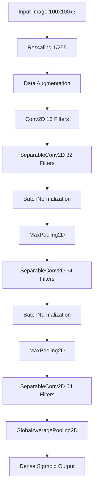

<div align="center">

# 🩺 AI-Powered Single-Cell Malaria Classification System
### Lightweight Deep Learning Pipeline for Malaria Microscopy Analysis

[](https://www.python.org/)
[](https://www.tensorflow.org/)
[](https://keras.io/)
[](https://opencv.org/)
[](https://gradio.app/)
[](https://huggingface.co/)
[](https://opensource.org/licenses/MIT)

</div>

---

# 🚀 Live Demo

> ## 🌐 Hugging Face Deployment
> https://huggingface.co/spaces/paulaman1/Malaria-classifier

---

# 📌 Project Overview

This project presents an end-to-end lightweight AI-powered medical imaging pipeline for detecting malaria parasites from single-cell microscopy images.

The complete system was designed using a custom Convolutional Neural Network (CNN) architecture optimized for:

- ✅ Lightweight deployment
- ✅ Fast inference
- ✅ Real-time web prediction
- ✅ Medical image classification
- ✅ Low computational cost
- ✅ Edge-device compatibility

Unlike large transfer learning models, this project focuses on building a highly compact and computationally efficient CNN architecture while still maintaining strong diagnostic performance.

The final trained model was deployed publicly using:

- Hugging Face Spaces
- Gradio
- TensorFlow/Keras

---

# 🧬 Dataset Information

## 📂 Dataset Used
### NLM-Falciparum-Thin-Cell-Images Dataset

Dataset Source:
National Library of Medicine (NLM)

The dataset contains microscopic thin blood smear images categorized into:

- 🔬 Parasitized (Infected)
- ✅ Uninfected (Healthy)

---

# 🔍 Exploratory Data Analysis (EDA)

Before training the model, Exploratory Data Analysis (EDA) was performed to understand the dataset structure and image distribution.

### Analysis Performed

- Class distribution analysis
- Dataset balance verification
- Image resolution inspection
- Train/Validation/Test structure verification
- Sample visualization

### Observation

The dataset was already balanced across both classes:

| Class | Distribution |
|---|---|
| Parasitized | Balanced |
| Uninfected | Balanced |

Therefore:
- No oversampling was required
- No undersampling was required
- No class weighting was needed

---

# 🧠 Custom CNN Architecture

Instead of using computationally expensive transfer learning architectures such as:

- ResNet
- EfficientNet
- DenseNet
- MobileNet

a fully custom lightweight CNN was engineered specifically for this dataset.

---

# 🏗️ Architecture Goals

The architecture was designed for:

- Low parameter count
- Faster inference
- Reduced memory usage
- Medical image feature extraction
- Easy deployment
- Edge-device compatibility

---

# ⚡ Lightweight Design

## Total Parameters
```text
~8.7K Parameters
```

This makes the network extremely lightweight compared to modern deep learning architectures.

---

# 🏗️ Network Architecture Flow



---

# 🧩 Key Deep Learning Components

## ✅ SeparableConv2D

Depthwise separable convolutions were used to:
- Reduce parameter count
- Reduce FLOPs
- Improve efficiency
- Maintain feature extraction quality

---

## ✅ BatchNormalization

Used to:
- Stabilize training
- Improve convergence
- Reduce internal covariate shift

---

## ✅ GlobalAveragePooling2D

Used instead of Flatten layers to:
- Reduce overfitting
- Reduce parameters
- Improve generalization

---

# 🔄 Data Augmentation

Advanced online augmentation techniques were applied dynamically during training.

## Techniques Used

| Augmentation | Purpose |
|---|---|
| RandomFlip | Orientation invariance |
| RandomRotation | Rotation robustness |
| RandomZoom | Scale robustness |
| RandomContrast | Illumination robustness |

---

# ⚙️ Training Configuration

## Hyperparameters

| Parameter | Value |
|---|---|
| Image Size | 100×100 |
| Batch Size | 32 |
| Epochs | 50 |
| Optimizer | Adam |
| Learning Rate | 0.001 |
| Loss Function | Binary Crossentropy |
| Label Smoothing | 0.1 |

---

# 📉 Loss Function Strategy

The model was trained using:

```python
BinaryCrossentropy(label_smoothing=0.1)
```

## Why Label Smoothing?

Label smoothing was used to:
- Reduce overconfidence
- Improve probability calibration
- Improve generalization
- Reduce overfitting

This is particularly important in medical AI systems where prediction confidence matters significantly.

---

# 📈 Learning Rate Optimization

## ReduceLROnPlateau Callback

Dynamic learning rate scheduling was applied using:

```python
ReduceLROnPlateau
```

Purpose:
- Automatic LR reduction during plateau
- More stable convergence
- Better optimization performance

---

# 💾 Model Checkpointing

The best-performing model was automatically saved using:

```python
ModelCheckpoint
```

Saved Model:
```text
best_malaria_model.keras
```

---

# 📊 Validation Performance

## Validation Classification Report

| Class | Precision | Recall | F1-Score |
|---|---|---|---|
| Uninfected | 0.97 | 0.94 | 0.96 |
| Parasitized | 0.95 | 0.98 | 0.96 |

---

## Validation Accuracy

```text
96%
```

---

# 🧪 Final Test Evaluation

The final model was evaluated on completely unseen test data.

---

# 📊 Final Test Metrics

| Metric | Score |
|---|---|
| Final Test Accuracy | 95.26% |
| Test Loss | 0.3041 |
| F1-Score (Parasitized) | 0.95 |
| F1-Score (Uninfected) | 0.95 |

---

# 📋 Final Test Classification Report

| Class | Precision | Recall | F1-Score |
|---|---|---|---|
| Parasitized | 0.97 | 0.94 | 0.95 |
| Uninfected | 0.94 | 0.97 | 0.95 |

---

# 🖼️ Visual Prediction Testing

Random unseen test samples were visually evaluated after training.

The visualization pipeline displayed:

- Actual class
- Predicted class
- Prediction confidence
- Correct/Incorrect prediction highlighting

This helped manually verify:
- Model consistency
- Generalization
- Error behavior

---

# 🚀 Hugging Face Deployment

The final `.keras` model was deployed publicly using:

- Hugging Face Spaces
- Gradio
- TensorFlow

---

# 🌐 Web Application Features

## Deployment Features

- 📤 Image Upload
- ⚡ Real-Time Inference
- 🔬 Malaria Cell Classification
- 📊 Confidence Estimation
- 🖼️ Random Test Dataset Gallery
- ☁️ Dynamic Model Loading
- 🧠 Interactive Prediction UI

---

# 🧠 Inference Pipeline

The deployed application performs:

1. Image Upload
2. Image Resizing
3. Tensor Conversion
4. CNN Inference
5. Confidence Calculation
6. Final Classification

---

# 🛡️ Confidence-Based Safety Layer

Medical AI systems should avoid blind predictions.

To improve deployment safety, a confidence-based rejection system was implemented.

---

## 🚫 Invalid / Unknown Image Rejection

If confidence is below:

```text
85%
```

the image is rejected as:

```text
Invalid / Unknown Image
```

This helps reduce unreliable predictions on:
- Random objects
- Natural images
- Non-cell images
- Unclear microscopy samples

---

# ⚠️ Uncertain Prediction Zone

Predictions between:

```text
0.45 - 0.55
```

are flagged as uncertain.

Purpose:
- Prevent forced binary decisions
- Encourage manual review
- Reduce prediction ambiguity

---

# ☁️ Dynamic Hugging Face Integration

The deployment dynamically downloads:
- `.keras` model
- random dataset samples

directly from the Hugging Face Hub using secure access tokens.

This keeps the frontend lightweight while allowing cloud-based resource management.

---

# 📦 Technologies Used

| Technology | Purpose |
|---|---|
| Python | Core Programming |
| TensorFlow | Deep Learning |
| Keras | CNN Modeling |
| OpenCV | Image Processing |
| NumPy | Numerical Computing |
| Matplotlib | Visualization |
| Seaborn | Confusion Matrix |
| Gradio | Web UI |
| Hugging Face Spaces | Cloud Deployment |

---

# 📁 Project Structure

```text
project/
│
├── app.py                         # Hugging Face Gradio application
├── README.md                      # Project documentation
├── requirements.txt               # Dependencies
├── best_malaria_model.keras       # Trained lightweight CNN model
│
├── training/
│   ├── train_model.ipynb          # Training pipeline
│   ├── evaluate_model.ipynb       # Evaluation & testing
│
├── assets/
│   ├── architecture.png
│   ├── confusion_matrix.png
│   └── predictions.png

```
---

# ⚠️ Disclaimer

This project is intended for:

- Research
- Educational purposes
- AI experimentation

This system is NOT a certified medical diagnostic tool.

Predictions should always be verified by:
- Medical professionals
- Pathologists
- Clinical experts

The model was trained specifically on malaria microscopy single-cell images.

Uploading:
- Random objects
- Natural images
- Non-medical content

may produce unreliable outputs.

---

# 🔮 Future Improvements

Potential future upgrades include:

- Multi-class malaria classification
- Explainable AI (Grad-CAM)
- Mobile deployment
- TFLite optimization
- Edge-AI acceleration
- Invalid-image dedicated training class
- Clinical uncertainty calibration
- Transfer learning comparison studies

---

# 📌 Conclusion

This project demonstrates that highly lightweight custom CNN architectures can still achieve strong medical image classification performance while remaining computationally efficient enough for lightweight deployment environments.

Final achievements:
- ✅ ~95% Test Accuracy
- ✅ Real-time inference
- ✅ Lightweight architecture
- ✅ Public deployment
- ✅ Interactive web application

---

# 👨‍💻 Author

## Aman Paul

AI • Deep Learning • Medical Imaging • Computer Vision

---
